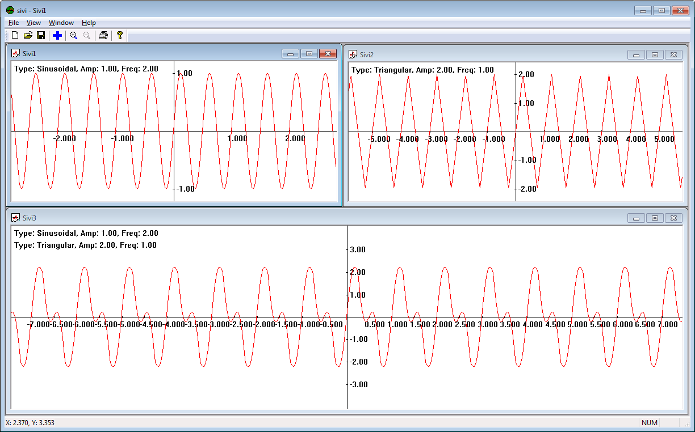
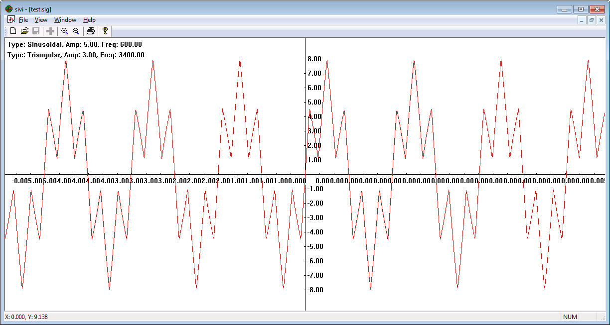

# SiVi (Signal Visualizer)

# About

SiVi is a Windows MDI (Multiple-Document Interface) application for visualization of sinusoidal, triangular or combined signals. It could read from and save signals to files and draws graphic of the signals to visualize them.

# Screen shots

SiVi MDI application

SiVi showing combined (sinusoidal and triangular) signal

SiVi showing sinusoidal with amplitude 5 and frequency 680

SiVi showing triangular signal with amplitude 3 and frequency 3400

# License

The source code of this application is licensed under GPL version 2 (see file [LICENSE](LICENSE)).
